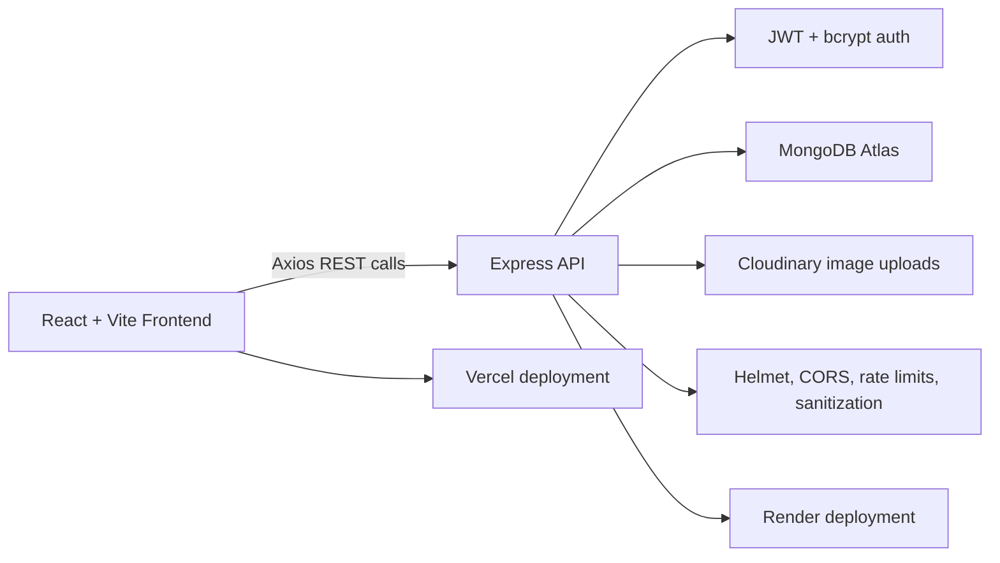
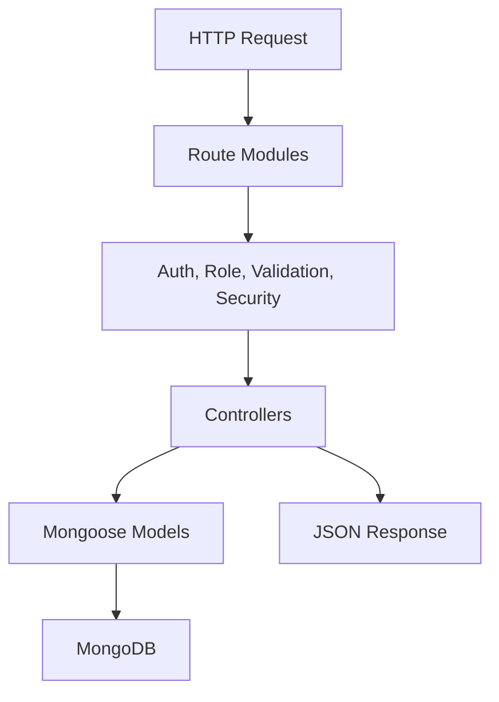
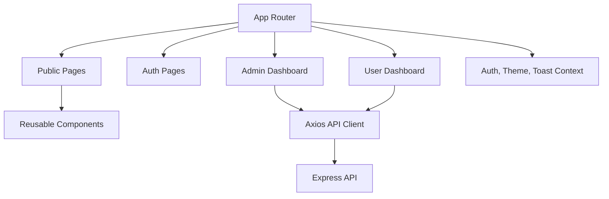

# Architecture

## System Diagram

## Backend Architecture

## Frontend Architecture

## Production Considerations

- Replace placeholder email utility with a real email provider.
- Use strong secrets and separate environment variables per environment.
- Enable MongoDB Atlas IP/network rules for deployment providers.
- Keep frontend and backend origins explicit in CORS.
- Configure Cloudinary upload presets or signed uploads for stricter media workflows.
- Add automated tests around auth, authorization, and core CRUD flows before launch.
