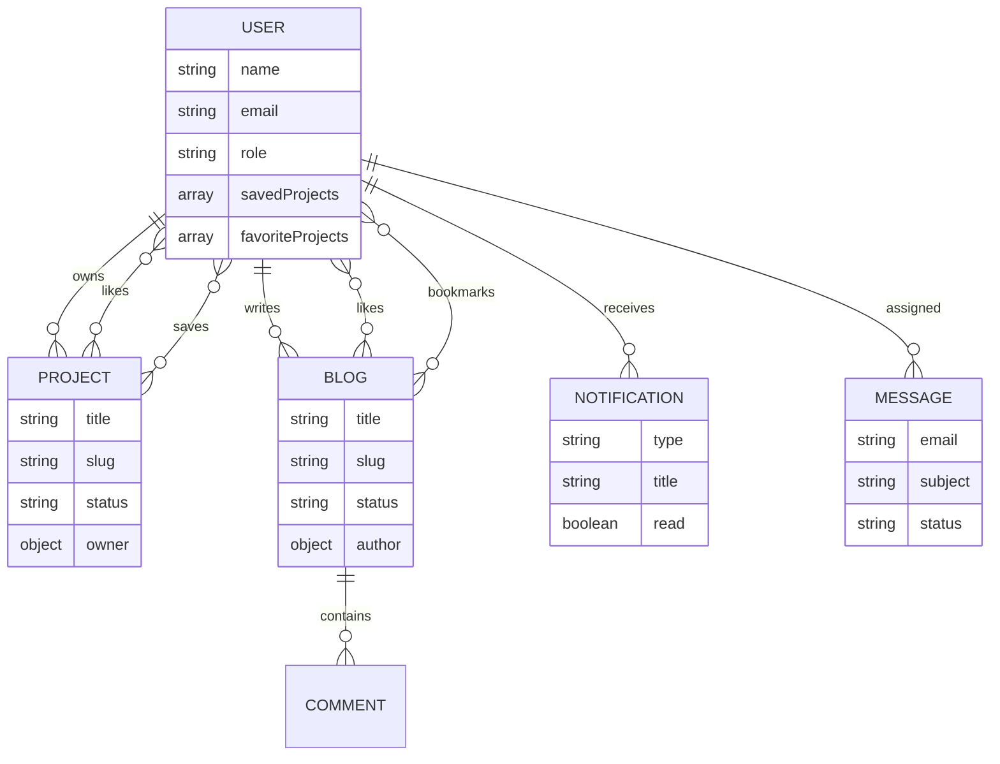

# Database Schema

## Collections

### Users

- `name`, `email`, `password`, `role`
- `headline`, `bio`, `location`, `website`, `avatar`
- `savedProjects`, `favoriteProjects`
- `emailVerified`, `passwordChangedAt`, password reset fields

### Projects

- `title`, `slug`, `summary`, `description`
- `category`, `status`, `tags`, `technologies`
- `image`, `gallery`, `demoUrl`, `repoUrl`
- `featured`, `views`, `likes`, `owner`

### Skills

- `name`, `category`, `level`, `icon`, `color`, `order`, `visible`

### Certificates

- `title`, `issuer`, `credentialId`, `credentialUrl`
- `issuedAt`, `expiresAt`, `image`, `visible`

### Testimonials

- `name`, `role`, `company`, `quote`, `rating`, `avatar`, `visible`

### Messages

- `name`, `email`, `subject`, `message`, `status`, `assignedTo`

### Blogs

- `title`, `slug`, `excerpt`, `body`, `coverImage`
- `tags`, `status`, `author`, `likes`, `bookmarks`, `comments`

### Notifications

- `user`, `type`, `title`, `body`, `read`, `link`

## ER Diagram

